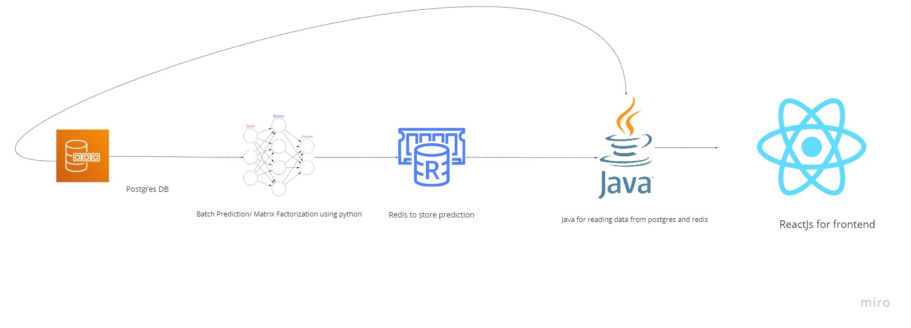

# MovieRecommender


## Table of Contents
* [About the project](#about-the-project)
  * [Built With](#built-with)
 * [Getting Started](#getting-started)
  * [Prerequisite](#prerequisite)
  * [How to](#how-to)
 * [Architecture](#architecture)
 * [Contact](#contact)
 
 ## About the project
 This is a simple movie recommendation website which built on top of stack of technologies and tools for the purpose of fun and learning.
 
 ### Built With
 * [Python](https://www.python.org/)
 * [Amazon Corretto aka Java](https://aws.amazon.com/corretto/)
 * [Postgres](https://www.postgresql.org/)
 * [Redis](https://redis.io/)
 * [Docker](https://www.docker.com/)
 
 <i> Please install required python libraries that stated in requirements.txt</i>
 
 ## Getting Started
 To start the project, you need to have docker installed in your machine. If you do not have it, you can download the docker at [Docker](https://www.docker.com/products/docker-desktop)
 
 ### Prerequisite
 * Pycharm
 * Visual Studio Code
 * Intellij
 
 ### How to 
 1. Clone the repo
 ```
 git clone git@github.com:KYKong1997/MovieRecommender.git
 ```
 2. Build docker image
 ```
 docker-compose build
 ```
 3. Start docker image
 ```
 docker-compose up
 ```
 
4. SSH into postgres container and load data into database tables

<i>The rating data is exceeding git file size limit. You may download the data from [Kaggle](https://www.kaggle.com/grouplens/movielens-20m-dataset#rating.csv)</i>

```
docker exec -it <containerId> psql -U postgres
## copy movie.csv to container
docker cp data/movie.csv <containerId>:/movie.csv
## change to movie db
psotgres#\c movie

## Create table
CREATE TABLE movie 
(
movieId serial,
title VARCHAR(1000),
....
)

## COPY csv to movie table
COPY movie FROM 'movie.csv' DELIMITER ',' CSV HEADER
```
<i> Please repeat the same process for users.csv and ratings.csv</i>

5. Batch Prediction and save predictions to Redis
```
python training_model/prediction.py
```

6. View result from browser by going to http://localhost:3000
* You can the user recommendation by entering userId into searchbox by default is no userId

## Architecture


## Contact
- Kuok Yong @kuokyong@live.com.my

